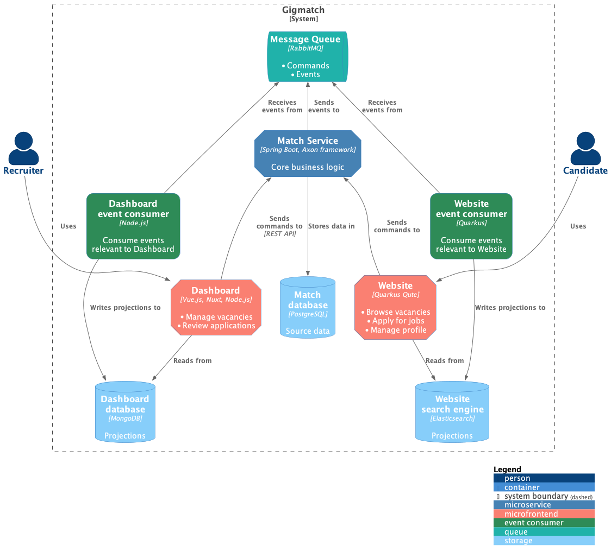

# Gigmatch

Personal reference implementation of an event-driven microservice architecture.

The example application is a job matching platform.

## Overview



Services are loosely-coupled, maintain their own storage and use their own dedicated stack. (i.e. Java, .NET, Node.js)

| Commands                               | Events                                   |
|----------------------------------------|------------------------------------------|
| Represent (user) actions               | Represent changes                        |
| Invoked synchronously through REST API | Consumed asynchronously from Event Store |
| Point-to-point                         | Publish/subscribe                        |
| Authenticated                          | Not authenticated                        |

## Codebase

* [Application services](./services)  
  The main application services, shown in the diagram above.
* [Cloud services](./cloud)  
  Additional Spring Cloud infrastructure services.

## Local development

### Requirements

* OpenJDK 17
* .NET 7
* Node.js 18
* Docker

### Docker containers

To get started with local development, you can run Docker containers for the [Cloud services](./local-dev/cloud.yml) and
the [Infrastructure](./local-dev/infrastructure.yml)

```bash
# Start/Stop containers for Infrastructure and Cloud services (recommended)
./local-dev/bin/cloud/up.sh
./local-dev/bin/cloud/down.sh
./local-dev/bin/cloud/follow-logs.sh

# Start/Stop Infrastructure containers only
# Useful when debugging Cloud services
./local-dev/bin/up.sh
./local-dev/bin/down.sh
./local-dev/bin/follow-logs.sh
```

You can then run the [application services](./services/README.md) manually.

> The containers are in-memory, meaning their storage is empty after startup.
>
> To initialize the main Kafka topic, start `match-service` first.

## License

[Public Domain](LICENSE)
