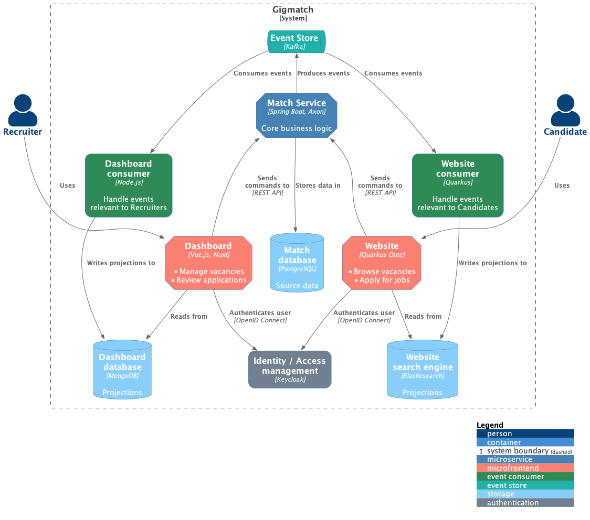

# Gigmatch

Personal reference implementation of an event-driven microservice architecture.

The example application is a job matching platform.

## Overview



* Services are loosely-coupled and run independently
* Services are implemented with their own dedicated stack (i.e. Java, .NET, Node.js)

Commands represent (user) actions and Events represent changes. Commands are synchronous and invoked
through REST APIs, while Events are asynchronous and transported through an event store.

## Codebase

* [Application services](./services)  
  The main application services, shown in the diagram above.
* [Cloud services](./cloud)  
  Additional Spring Cloud infrastructure services.

## Local development

### Requirements

* OpenJDK 17
* .NET 7
* Node.js 18
* Docker

### Docker containers

To get started with local development, you can run Docker containers for
the [Infrastructure](./local-dev/infrastructure.yml) and, optionally, the [Cloud services](./local-dev/cloud.yml).

```bash
# Start/Stop both Infrastructure and Cloud containers (recommended)
./local-dev/bin/cloud/up.sh
./local-dev/bin/cloud/down.sh
./local-dev/bin/cloud/follow-logs.sh

# Start/Stop only Infrastructure containers
# Useful when debugging the Cloud containers
./local-dev/bin/up.sh
./local-dev/bin/down.sh
./local-dev/bin/follow-logs.sh
```

You can then run the [application services](./services/README.md) manually.

> The containers are in-memory, meaning their storage is empty after startup.
>
> To initialize the main Kafka topic, start `match-service` first.

## License

[Public Domain](LICENSE)
