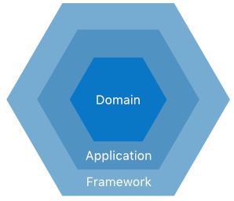

# Match service

* Domain-Driven Design
* Event sourcing and CQRS
* Message-driven

## Architecture

The codebase uses a [Hexagonal architecture](https://en.wikipedia.org/wiki/Hexagonal_architecture_(software)), also
known as Ports and Adapters.

> The "Framework" layer is often called the "Infrastructure" layer, but these terms mean the same.

| Module                       | Description                                          |
|------------------------------|------------------------------------------------------|
| [domain](./domain)           | Value objects, Entities, Aggregates, Domain Services |         
| [application](./application) | Use Case, Input Port, Output Port interfaces         |      
| [framework](./framework)     | Use Case, Input Port, Output Port implementations    |
| [app](./app)                 | Spring Boot application, REST API, test set          |

### Driving operations and Input Ports

*Driving operation* are the means through which a user (or other type of actor) accesses the application.

Some examples of driving operations:

* Invoking REST API endpoints
* Command-line input
* Consuming messages from a queue (RabbitMQ, Kafka)

*Input Ports* implement use cases and are invoked by Driving operations.

Example:

* [VacancyUseCase](./application/src/main/kotlin/nl/runnable/gigmatch/application/vacancy/VacancyUseCase.kt)  
  Defines the high-level use case
* [VacancyInputPort](./application/src/main/kotlin/nl/runnable/gigmatch/application/vacancy/VacancyInputPort.kt)  
  Implements the use case interface
* [VacancyCommandHandlers](./framework/src/main/kotlin/nl/runnable/gigmatch/framework/vacancy/VacancyCommandHandlers.kt)  
  The Driving operations, implemented as `java.util.function.Consumer`

### Driven operations and Output Ports

*Driven operations* occur in response to Driving operations and are invoked by the Application itself. They can be
considered secondary operations.

Examples of Driven operations:

* Persisting an entity in a databases
* Writing messages to a queue
* Sending an e-mail

Driven operations use *Output Ports* to interact with the Framework.

Example:

* [VacancyOutputPort](./application/src/main/kotlin/nl/runnable/gigmatch/application/vacancy/VacancyOutputPort.kt)  
  Defines an Output Port
* [AxonVacancyAdapter](./framework/src/main/kotlin/nl/runnable/gigmatch/framework/vacancy/AxonVacancyAdapter.kt)  
  Axon-based implementation of the Output Port
* [VacancyInputPort](./application/src/main/kotlin/nl/runnable/gigmatch/application/vacancy/VacancyInputPort.kt)    
  Invokes the Output Port as a Driven operation

### Resources

* [Designing Hexagonal Architecture with Java ](https://www.packtpub.com/product/designing-hexagonal-architecture-with-java/9781801816489)
* [Patterns, Principles, and Practices of Domain-Driven Design](https://www.oreilly.com/library/view/patterns-principles-and/9781118714706/)
